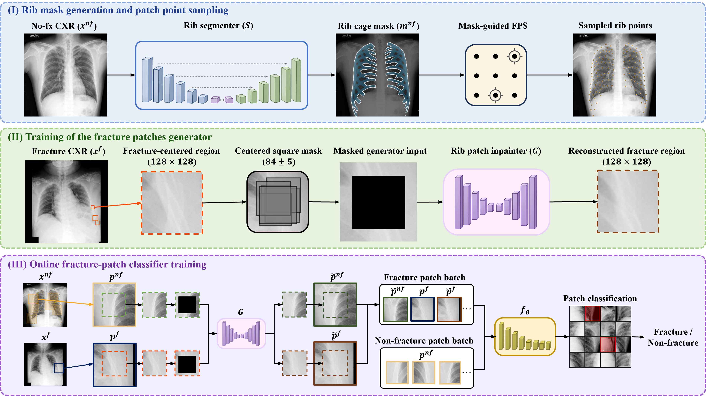

# RibPatchGAN

RibPatchGAN for Rib Fracture Detection on Chest Radiographs Using Patch Learning and Online Inpainting.



Panels (I)–(III) correspond to the three steps below.

Three steps:

1. **Step 1 — rib maskpoint generation** (standalone):
   U-Net rib segmentation → farthest-point-sampled rib points per image.
2. **Step 2 — LaMa inpainting GAN**: trains a label-conditioned LaMa generator
   to inpaint fractures into 128×128 rib patches.
3. **Step 3 — classifier with GAN augmentation**: ConvNeXt-Tiny patch
   classifier; the step-2 generator pastes synthetic fractures (additive
   low-weight BCE) and is cooperatively fine-tuned with distribution-stable
   feedback from a frozen EMA teacher (no adversarial objective).

Steps 2→3 run end-to-end: step 3 consumes `G_latest.pt` from step 2 directly.

## Layout

```
configs/default.yaml          ALL data paths + step-2/step-3 hyperparameters
scripts/                      entry points (per step, test, end-to-end, smoke)
common/                       config loader + shared LaMa generator/discriminator
step1_rib_maskpoint_generation/
step2_train_inpainting_gan/   train.py, losses.py, data/
step3_train_classifier_with_gan/
    train.py, test.py, engine.py, losses.py, metrics.py
    data/                     items, preprocessing, geometry, augmentation, dataset
    models/                   patch classifier
    gan_augmentation/         generator wrapper, paste op, cooperative G feedback
```

## Setup

```bash
pip install -r requirements.txt
```

Edit `configs/default.yaml` → `datasets:` to point at your data. Each dataset
folder must look like:

```
<images_root>/
  fx/         fracture images (.png/.jpg)
  nofx/       normal images
  fxlabel/    labelme-style fracture bbox JSONs
  maskpoint/  rib-point JSONs (from step 1)
```

`train` and `valid` are single datasets; `tests` is a list — use one or
several test sets. Each test entry chooses its operating point
(`threshold: youden_valid` or `spec_target`).

## Usage

```bash
# step 1: generate rib maskpoints for a folder of images (repeat per dataset)
./scripts/step1_generate_rib_maskpoints.sh <image_dir>

# steps 2+3 + test, end-to-end
./scripts/run_end_to_end.sh

# or run each part separately
./scripts/step2_train_inpainting_gan.sh
./scripts/step3_train_classifier.sh
./scripts/run_test.sh

# tiny sanity run of the whole pipeline (minutes, meaningless numbers)
./scripts/run_smoke_test.sh
```

Env overrides (see each script header): `CONFIG`, `GAN_EPOCHS`, `CLS_EPOCHS`,
`RESULTS_ROOT`, `RUN_GAN`/`RUN_CLS`/`RUN_TEST`.

## Outputs

```
results/step2_inpainting_gan/
    checkpoints/{G_latest,D_latest,G_best}.pt   train_log.csv   vis/epXXX.png
results/step3_classifier/
    best_auc.pt latest.pt metrics.csv
    roc_scores/<run>__best_auc__<testset>_scores.csv   per-image scores
    eval_operating_points.csv     one row per test set at its operating point
    final_test_metrics.csv        per test set at valid-Youden threshold
```

Test numbers come from ONE inference pass: `test.py` writes per-image score
CSVs and rebuilds every metric table offline from them.

## Notes

- No trained weights are distributed with this repository.
  `step1_rib_maskpoint_generation/` contains only the rib-segmenter
  *inference* code; train your own U-Net rib segmenter on the public
  [VinDr-RibCXR](https://vindr.ai/datasets/ribcxr) dataset (merge its 20
  per-rib annotations into one binary mask, as described in the paper) and
  place the checkpoint at `step1_rib_maskpoint_generation/weights/weight.pt`.
  Step 2 and step 3 checkpoints are produced by running the pipeline on your
  own data; none are shipped here either.
- The site-statistics file (`paths.site_stats`) is computed automatically from
  the train set on first run; all datasets are standardized to it.
- Evaluation dataloaders are intentionally single-process (`num_workers=0`):
  multi-worker IPC leaked tens of GB of shared memory on large test sets.

## Acknowledgements

The FFC (Fast Fourier Convolution) blocks in `common/lama/ffc.py` are adapted
from [LaMa](https://github.com/advimman/lama) (Suvorov et al., WACV 2022;
Copyright 2021 Samsung Research), released under the Apache License 2.0; see
the file header for the changes made. LaMa in turn adapts the original
[FFC](https://github.com/pkumivision/FFC) implementation (Chi et al., NeurIPS
2020). All other files under `common/lama/` (generator, discriminator, AdaIN
label conditioning, training loop) are original to this project.
